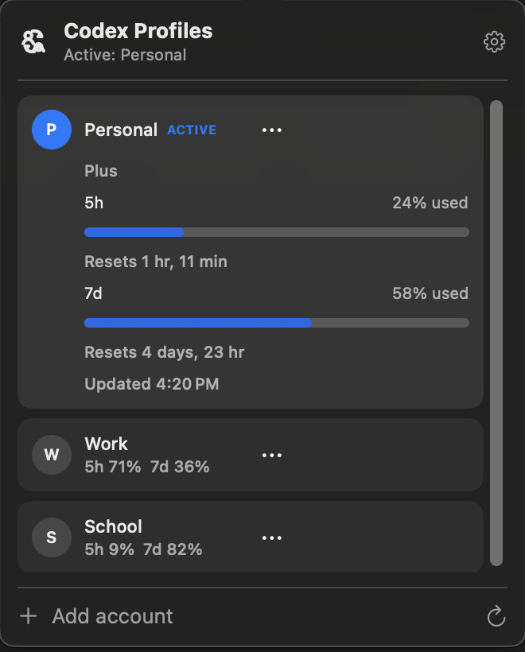
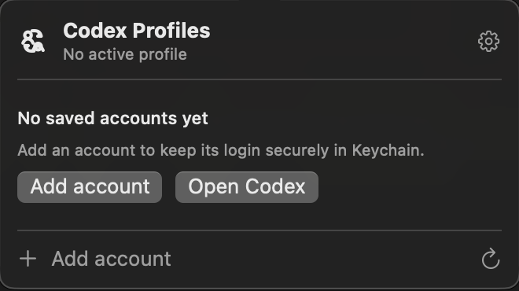
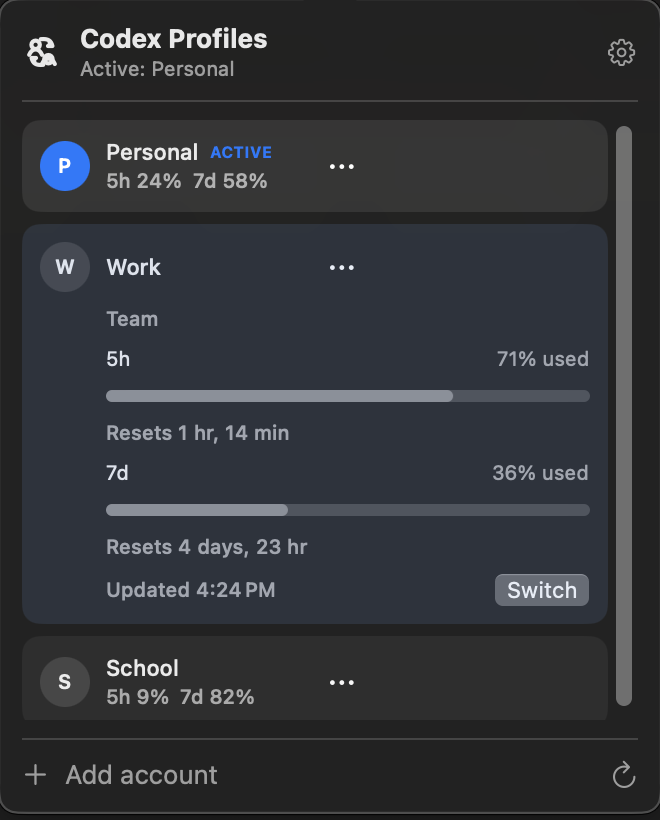

# Codex Profiles

**Switch Codex accounts from the macOS menu bar and see each account’s usage before you switch.**

Codex Profiles is a tiny, unofficial companion for people who use the Codex desktop app with more than one ChatGPT account. It keeps inactive credentials in macOS Keychain, shows saved accounts together, and safely places only the selected account in Codex’s live auth file.

<p align="center">
  
</p>

> [!IMPORTANT]
> Codex Profiles is an experimental power-user utility. It depends on Codex desktop internals that may change. 

## Why it exists

Switching accounts in Codex normally means signing out, signing back in, and guessing which account still has capacity. Codex Profiles turns that into a small menu-bar workflow:

1. Save each account through Codex’s own browser sign-in.
2. Compare five-hour and weekly usage in one place.
3. Switch explicitly when you choose.

| 1. Save an account | 2. Compare usage | 3. Switch profiles |
| --- | --- | --- |
|  |  |  |
| Sign in through Codex’s browser flow. | Open the panel or press Refresh. | Expand a profile and press Switch. |

## Quick start

Requirements:

- Apple Silicon Mac
- macOS 13 or newer
- The official Codex desktop app
- Xcode Command Line Tools (`xcode-select --install`)

Build, install, and open the app:

```sh
git clone https://github.com/minh-mhl-le/codex-profiles.git
cd codex-profiles
zsh scripts/install-app.sh
```

Codex Profiles appears only in the menu bar—there is no Dock icon. On the first Keychain prompt, choose **Always Allow** so saved profiles can load without asking every time.

The app is built and ad-hoc signed on your Mac. There is no downloadable binary yet; a signed and notarized release will come later.

## Give this to your coding agent

Paste this into a local coding agent that can use the terminal on your Mac:

```text
Set up Codex Profiles from https://github.com/minh-mhl-le/codex-profiles.
Follow docs/AGENT_SETUP.md exactly: verify prerequisites, clone or update the repo,
build and install the app, launch it, and verify the menu-bar process. Never read,
print, copy, or edit ~/.codex/auth.json or any credential value. Leave browser sign-in
and macOS Keychain approval to me.
```

See [Agent setup](docs/AGENT_SETUP.md) for the full handoff contract.

## What happens when you switch

Codex Profiles:

- checks whether Codex has an active task and blocks the switch if it does;
- verifies the target account, reopening Codex’s sign-in flow if its credentials expired;
- asks Codex to quit, then atomically replaces `~/.codex/auth.json`;
- rolls back the previous account if verification or replacement fails; and
- reopens Codex when enabled in Settings.

Your projects, local tasks, drafts, workspace roots, settings, databases, and caches remain in the same `~/.codex` directory. Only the live auth file changes.

Read [How it works](docs/HOW_IT_WORKS.md) for the storage and switching model.

## Privacy and safety

- Inactive account credentials are stored in macOS Keychain.
- Only the active account is placed in Codex’s live `auth.json`.
- Usage checks run in isolated temporary `CODEX_HOME` directories.
- Usage refreshes only when the panel opens or you press Refresh.
- There is no telemetry, background polling, credential export, or automatic account selection.

Never post `auth.json`, tokens, cookies, Keychain contents, or unredacted credential-bearing logs in an issue. Report auth or credential vulnerabilities privately through [GitHub Security Advisories](https://github.com/minh-mhl-le/codex-profiles/security/advisories/new).

## Settings

The separate Settings window includes:

- Launch at Login
- Refresh usage when opened
- Open Codex after switching
- Sound effects
- Delete saved profiles

## Troubleshooting

**The menu-bar icon is missing:** Open System Settings → Control Center and make sure macOS is not hiding it. Menu-bar managers may also place new items in a hidden section.

**Keychain asks every time:** Choose **Always Allow** for the Codex Profiles Keychain item.

**Usage is unavailable:** Open Codex once and confirm the account is signed in, then press Refresh.

**Switching is blocked:** Finish or interrupt the active Codex task, return to Codex Profiles, and switch again.

**Codex changed and the app stopped working:** Check the [latest issues](https://github.com/minh-mhl-le/codex-profiles/issues) before filing a sanitized bug report. Compatibility with future Codex releases is not guaranteed.

## Build without installing

```sh
zsh scripts/build-app.sh
open "dist/Codex Profiles.app"
```

The Swift package has no third-party dependencies. The app bundle is written to `dist/`.

To update an existing checkout:

```sh
git pull --ff-only
zsh scripts/install-app.sh
```

## Contributing

Focused fixes and compatibility updates are welcome. Read [CONTRIBUTING.md](CONTRIBUTING.md) before opening a pull request and [SECURITY.md](SECURITY.md) before reporting an auth-related issue.

MIT licensed. See [LICENSE](LICENSE).
